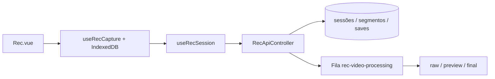

# Arquitetura do REC

## Visão geral

O REC usa um único fluxo contínuo:

- sessão de câmera com lease e token;
- segmentos no IndexedDB do celular;
- upload contínuo e idempotente;
- SAVE com targets por câmera;
- FFmpeg assíncrono na fila `rec-video-processing` (raw → preview → final).

## Componentes

- Laravel/Inertia: página, autenticação, API e broadcasting.
- Cache/Redis: leases de câmera e cooldown de SAVE por lado.
- IndexedDB (`qnf-rec`): segmentos e fila de upload no aparelho.
- Queue worker: processamento pesado de vídeo.
- FFmpeg/ffprobe: concatenação e reencode.

## Ativação

Não há feature flag V1/V2. Após migrate, worker e FFmpeg, o REC MODE já usa este fluxo.
