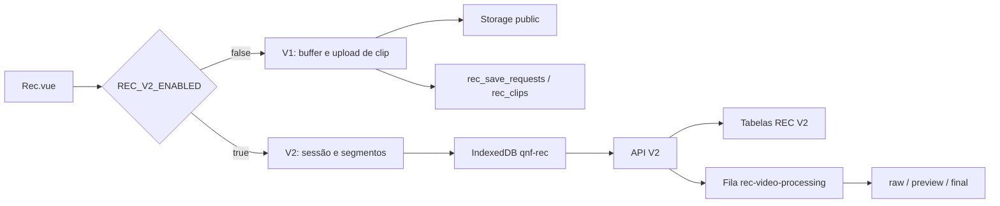

# Arquitetura do REC

## Visão geral

O REC mantém dois fluxos compatíveis na mesma tela (`resources/js/Pages/Rec.vue`):

- **V1 (legado):** buffer no navegador, evento de SAVE, upload de um clip por câmera e FFmpeg síncrono na requisição.
- **V2:** sessão com lease, segmentos contínuos em IndexedDB, upload idempotente e geração assíncrona de raw/preview/final.

`REC_V2_ENABLED=false` é o padrão seguro. O `RecController@show` entrega a flag ao frontend, que escolhe `useRecSession`/`useRecBuffer` (V1) ou os composables em `composables/rec/` (V2).

`REC_CONTINUOUS_SEGMENTS_ENABLED` existe na configuração e no diagnóstico; a seleção atual do frontend é feita por `REC_V2_ENABLED`.

## Componentes

- Laravel/Inertia: página, autenticação, API e broadcasting.
- Cache Laravel: leases e debounce; Redis é recomendado, mas cache `database` também funciona.
- Banco relacional: estado operacional, idempotência, targets e vínculos de segmentos.
- Storage Laravel: segmentos e artefatos de vídeo.
- FFmpeg/ffprobe: concatenação, reencode, probe e normalização.
- Queue worker: processamento pesado e publicação de eventos.

## Regra de ativação

Não habilite a V2 antes de: migrar o banco, validar FFmpeg, garantir o worker dedicado e testar uma câmera. Faça rollout gradual e reverta apenas a flag em caso de incidente.
