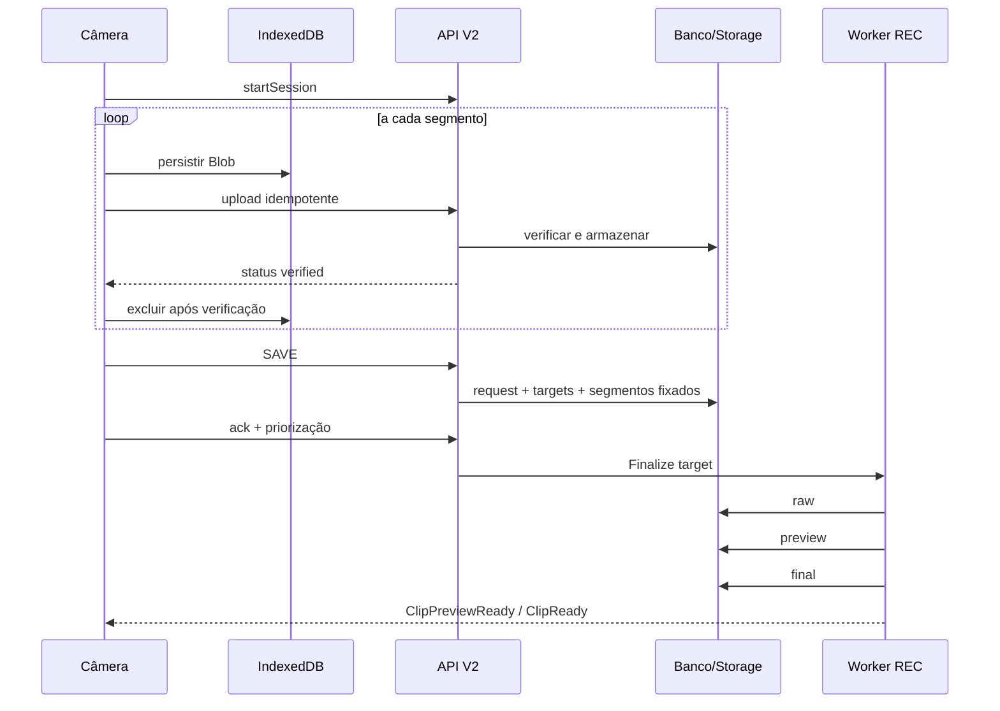

# Fluxo alvo — REC V2

1. A câmera abre uma sessão para um `camera_tag` e recebe UUID, token e lease.
2. `MediaRecorder` gira segmentos (padrão: 5 s), persistidos no IndexedDB `qnf-rec`.
3. A fila local envia cada segmento com sequência, timestamps, checksum e chave idempotente.
4. Heartbeats renovam o lease, sincronizam relógio e retornam SAVEs pendentes.
5. Um SAVE define `[capture_from, capture_until]` (buffer de 30 s + post-roll de 2 s) e cria um target por câmera ativa.
6. Segmentos sobrepostos são fixados em `rec_save_target_segments`; a câmera confirma o SAVE e prioriza uploads locais.
7. `FinalizeRecSaveTarget` monta o raw; `BuildRecClipPreview` produz o preview; `BuildRecClipFinal` produz o arquivo final.
8. Eventos `ClipPreviewReady` e `ClipReady` atualizam a interface. Reconciliação recupera targets parados.

Todos os jobs pesados usam `REC_PROCESSING_QUEUE`, cujo padrão é `rec-video-processing`.
